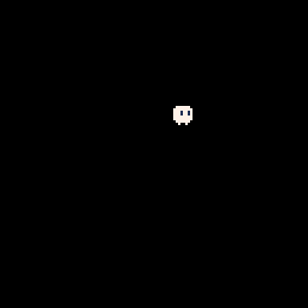

# Aula 1 

Em ```teoria.lua``` pode ser encontrado todos os conceitos explicados durante a aula.

Em ```calc.lua``` está a calculadora basica que programamos durante a aula.

Em ```pico8-controller.lua``` está o código que escrevemos para mover o jogador na tela.



Qualquer duvida pode me chamar no WhatsApp!
